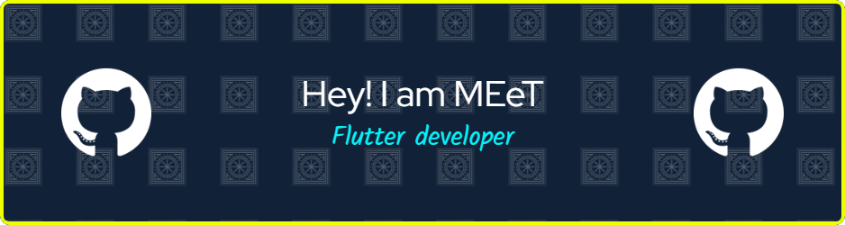

- 👋 Hi, I’m @MEeTpanchal1222
- 👀 I’m interested in flutter Development
- 🌱 I’m currently learning C,C++, Dart,core flutter,advanced  flutter
- 💞️ I’m looking to collaborate on Flutter developers 
- 📫 How to reach me panchalmeetr97@gmail.com
<h3 align="left">🔥   My Stats :</h3>

###

  

## 🌐 Socials:
###

  
  

<h3 align="left">Connect with me:</h3>

<h3 align="left">Languages and Tools:</h3>

     <a href="https://www.figma.com/" target="_blank" rel="noreferrer">  

  

  

  

&nbsp;

<!---
MEeTpanchal1222/MEeTpanchal1222 is a ✨ special ✨ repository because its `README.md` (this file) appears on your GitHub profile.
You can click the Preview link to take a look at your changes.
--->
